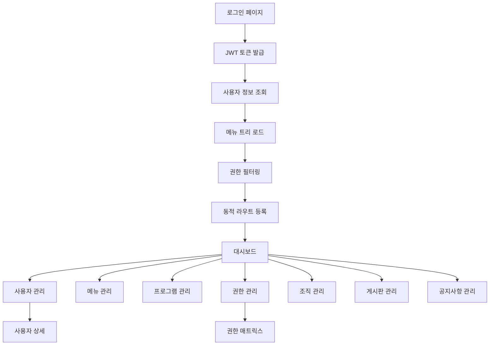

# Vue 3 + Vuestic UI RBAC 관리자 프론트엔드 요구사항 문서

## 1. 프로젝트 개요

Vue 3, Vite, TypeScript, Vuestic UI, Pinia를 기반으로 한 현대적인 RBAC(역할 기반 접근 제어) 관리자 프론트엔드 프로젝트입니다. JWT 기반 인증과 동적 메뉴 시스템을 통해 권한별 차별화된 관리 기능을 제공합니다.

이 프로젝트는 생산성과 품질을 최우선으로 하며, 확장 가능하고 유지보수가 용이한 엔터프라이즈급 관리자 도구를 목표로 합니다.

## 2. 핵심 기능

### 2.1 사용자 역할

| 역할 | 등록 방법 | 핵심 권한 |
|------|-----------|----------|
| 시스템 관리자 | 초기 설정 또는 상위 관리자 초대 | 모든 메뉴 및 기능 접근, 사용자 권한 관리, 시스템 설정 |
| 일반 관리자 | 시스템 관리자 초대 | 할당된 메뉴 접근, 제한된 관리 기능, 사용자 관리 |
| 운영자 | 관리자 초대 | 기본 운영 기능, 조회 중심 권한, 게시판 관리 |
| 뷰어 | 관리자 초대 | 읽기 전용 접근, 대시보드 조회, 보고서 열람 |

### 2.2 기능 모듈

관리자 프론트엔드는 다음과 같은 주요 페이지로 구성됩니다:

1. **로그인/인증**: JWT 기반 로그인, 자동 토큰 재발급, 안전 로그아웃
2. **대시보드**: 시스템 현황 요약, 주요 지표 표시, 최근 활동 로그
3. **사용자 관리**: 사용자 목록 조회, 사용자 등록/수정/삭제, 사용자 상태 관리
4. **메뉴 관리**: 동적 메뉴 구조 설정, 메뉴 순서 변경, 메뉴 활성화/비활성화
5. **프로그램 관리**: 시스템 프로그램 등록, 프로그램 정보 관리, 버전 관리
6. **권한(역할) 관리**: 역할 정의, 권한 할당, 역할별 메뉴 접근 권한 설정
7. **조직 관리**: 조직 구조 관리, 부서별 사용자 할당, 조직도 관리
8. **게시판 관리**: 게시판 생성/설정, 게시글 관리, 댓글 관리
9. **공지사항 관리**: 공지사항 작성/수정/삭제, 공지 대상 설정

### 2.3 페이지 세부사항

| 페이지명 | 모듈명 | 기능 설명 |
|----------|--------|----------|
| 로그인 | 인증 모듈 | JWT 로그인, 토큰 관리, 자동 로그인, 비밀번호 찾기 |
| 대시보드 | 메인 대시보드 | 시스템 현황 차트, 통계 위젯, 빠른 액션 버튼, 최근 활동 |
| 사용자 관리 | 사용자 목록 | 사용자 검색/필터링, 페이지네이션, CRUD 기능, 일괄 작업 |
| 사용자 관리 | 사용자 상세 | 사용자 정보 수정, 권한 설정, 활동 이력 조회, 비밀번호 재설정 |
| 메뉴 관리 | 메뉴 트리 | 드래그앤드롭 메뉴 정렬, 계층 구조 관리, 메뉴 속성 설정 |
| 프로그램 관리 | 프로그램 목록 | 프로그램 등록/수정/삭제, 버전 관리, 배포 상태 확인 |
| 권한 관리 | 권한 매트릭스 | 역할-메뉴 권한 매핑, 일괄 권한 설정, 권한 상속 관리 |
| 조직 관리 | 조직 구조 | 조직도 관리, 부서 생성/수정, 사용자 배정, 조직 계층 |
| 게시판 관리 | 게시판 설정 | 게시판 생성/설정, 권한 설정, 게시글 모니터링, 댓글 관리 |
| 공지사항 관리 | 공지사항 | 공지 작성/수정/삭제, 공지 대상 설정, 발송 이력 관리 |

## 3. 핵심 프로세스

### 인증 및 권한 워크플로우

사용자는 로그인 후 JWT 토큰을 받아 인증 상태를 유지합니다. 서버에서 제공하는 메뉴 트리와 사용자 권한을 비교하여 접근 가능한 메뉴만 동적으로 렌더링됩니다. 토큰 만료 시 자동으로 refresh 토큰을 사용하여 재발급하며, 실패 시 안전하게 로그아웃됩니다.

### 동적 메뉴 시스템

서버에서 메뉴 구조를 JSON 형태로 제공하며, 각 메뉴 항목은 required permissions 배열을 포함합니다. 클라이언트는 현재 사용자의 권한과 비교하여 접근 가능한 라우트만 동적으로 등록하고 렌더링합니다.

## 4. 사용자 인터페이스 디자인

### 4.1 디자인 스타일

- **주요 색상**: #1976D2 (Primary Blue), #F5F5F5 (Light Gray)
- **보조 색상**: #4CAF50 (Success Green), #FF9800 (Warning Orange), #F44336 (Error Red)
- **버튼 스타일**: Vuestic UI 기본 스타일, 둥근 모서리, 부드러운 그림자
- **폰트**: 'Noto Sans KR' 14px (기본), 16px (제목), 12px (캡션)
- **레이아웃**: 카드 기반 레이아웃, 좌측 사이드바 + 상단 헤더
- **아이콘**: Material Design Icons, 일관된 스타일과 크기
- **애니메이션**: 부드러운 전환 효과 (300ms), 페이드 인/아웃
- **다크모드**: Vuestic UI 다크 테마 지원, 사용자 설정 저장

### 4.2 페이지 디자인 개요

| 페이지명 | 모듈명 | UI 요소 |
|----------|--------|--------|
| 로그인 | 인증 폼 | 중앙 정렬 카드, 브랜드 로고, 입력 필드 검증, 로딩 스피너 |
| 대시보드 | 메인 영역 | 그리드 레이아웃, 차트 위젯, 통계 카드, 그라데이션 배경 |
| 사용자 관리 | 목록 테이블 | VaDataTable, 검색 필터, 페이지네이션, 액션 버튼 |
| 메뉴 관리 | 트리 구조 | 드래그앤드롭 트리, 컨텍스트 메뉴, 실시간 미리보기 |
| 권한 관리 | 매트릭스 테이블 | 체크박스 그리드, 일괄 선택, 권한 상태 표시 |
| 헤더 | 네비게이션 | VaNavbar, 로고, 검색바, 브레드크럼, 사용자 드롭다운 |
| 사이드바 | 메뉴 네비게이션 | VaSidebar, 동적 메뉴 트리, 축소/확장, 활성 상태 |

### 4.3 반응형 디자인

데스크톱 우선 설계로 개발하며, 태블릿(768px 이상)과 모바일(< 768px)에서도 최적화된 경험을 제공합니다. 모바일에서는 사이드바가 오버레이 드로어로 변환되며, 터치 인터랙션을 고려한 버튼 크기와 간격을 적용합니다.

- **데스크톱**: 사이드바 260px(확장), 72px(축소)
- **태블릿**: 사이드바 오버레이, 햄버거 메뉴
- **모바일**: 전체 화면 드로어, 터치 최적화