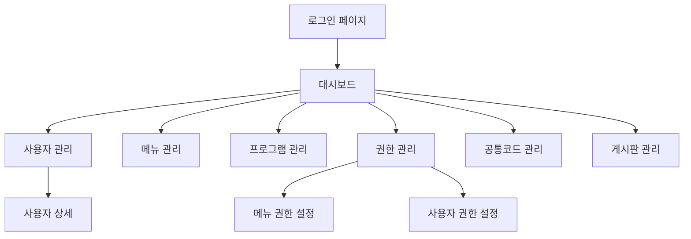

# Vue 3 + Vuestic-admin 관리자 사이트 요구사항 문서

## 1. 프로젝트 개요

Vue 3, Vite, TypeScript, Vuestic-admin을 기반으로 한 현대적인 관리자 사이트 개발 프로젝트입니다. FastAPI 백엔드와 연동하여 사용자 및 권한 관리, 동적 메뉴 제어 등의 핵심 기능을 제공합니다.

이 프로젝트는 기업용 관리자 도구로서 확장 가능하고 유지보수가 용이한 아키텍처를 목표로 합니다.

## 2. 핵심 기능

### 2.1 사용자 역할

| 역할 | 등록 방법 | 핵심 권한 |
|------|-----------|----------|
| 시스템 관리자 | 초기 설정 또는 상위 관리자 초대 | 모든 메뉴 및 기능 접근, 사용자 권한 관리 |
| 일반 관리자 | 시스템 관리자 초대 | 할당된 메뉴 접근, 제한된 관리 기능 |
| 운영자 | 관리자 초대 | 기본 운영 기능, 조회 중심 권한 |

### 2.2 기능 모듈

관리자 사이트는 다음과 같은 주요 페이지로 구성됩니다:

1. **대시보드**: 시스템 현황 요약, 주요 지표 표시, 최근 활동 로그
2. **사용자 관리**: 사용자 목록 조회, 사용자 등록/수정/삭제, 사용자 상태 관리
3. **메뉴 관리**: 메뉴 구조 설정, 메뉴 순서 변경, 메뉴 활성화/비활성화
4. **프로그램 관리**: 시스템 프로그램 등록, 프로그램 정보 관리, 버전 관리
5. **메뉴 권한 관리**: 역할별 메뉴 접근 권한 설정, 권한 매트릭스 관리
6. **사용자 권한 관리**: 개별 사용자 권한 설정, 권한 그룹 관리
7. **공통코드 관리**: 시스템 공통코드 등록/수정, 코드 그룹 관리
8. **게시판 관리**: 게시판 생성/설정, 게시글 관리, 댓글 관리
9. **로그인/인증**: JWT 기반 로그인, 토큰 갱신, 로그아웃

### 2.3 페이지 세부사항

| 페이지명 | 모듈명 | 기능 설명 |
|----------|--------|----------|
| 대시보드 | 메인 대시보드 | 시스템 현황 표시, 차트 및 통계 위젯, 빠른 액션 버튼 |
| 사용자 관리 | 사용자 목록 | 사용자 검색/필터링, 페이지네이션, CRUD 기능 |
| 사용자 관리 | 사용자 상세 | 사용자 정보 수정, 권한 설정, 활동 이력 조회 |
| 메뉴 관리 | 메뉴 트리 | 드래그앤드롭 메뉴 정렬, 계층 구조 관리, 메뉴 속성 설정 |
| 프로그램 관리 | 프로그램 목록 | 프로그램 등록/수정/삭제, 버전 관리, 배포 상태 확인 |
| 권한 관리 | 권한 매트릭스 | 역할-메뉴 권한 매핑, 일괄 권한 설정, 권한 상속 관리 |
| 공통코드 관리 | 코드 관리 | 코드 그룹별 관리, 코드 검색, 사용 현황 추적 |
| 게시판 관리 | 게시판 설정 | 게시판 생성/설정, 권한 설정, 게시글 모니터링 |
| 로그인 | 인증 | 이메일/패스워드 로그인, 토큰 관리, 자동 로그인 |

## 3. 핵심 프로세스

### 관리자 워크플로우

관리자는 로그인 후 대시보드에서 시스템 현황을 확인하고, 각 관리 메뉴를 통해 시스템을 운영합니다. 권한에 따라 접근 가능한 메뉴가 동적으로 제어됩니다.

### 사용자 관리 프로세스

시스템 관리자가 새 사용자를 등록하고 권한을 할당하면, 해당 사용자는 할당된 권한에 따라 메뉴에 접근할 수 있습니다.

## 4. 사용자 인터페이스 디자인

### 4.1 디자인 스타일

- **주요 색상**: #2C3E50 (네이비), #F8F9FA (라이트 그레이)
- **보조 색상**: #F5F5DC (베이지), #6C757D (미디엄 그레이)
- **버튼 스타일**: 둥근 모서리, 부드러운 그림자 효과
- **폰트**: 'Noto Sans KR' 14px (기본), 16px (제목)
- **레이아웃**: 카드 기반 레이아웃, 좌측 사이드바 네비게이션
- **아이콘**: Material Design Icons, 일관된 스타일
- **애니메이션**: 페이드 인/아웃, 슬라이드 전환 (300ms)

### 4.2 페이지 디자인 개요

| 페이지명 | 모듈명 | UI 요소 |
|----------|--------|--------|
| 대시보드 | 메인 영역 | 그리드 레이아웃, 차트 위젯, 통계 카드, 부드러운 그라데이션 배경 |
| 사용자 관리 | 목록 테이블 | 데이터 테이블, 검색 필터, 페이지네이션, 액션 버튼 |
| 메뉴 관리 | 트리 구조 | 드래그앤드롭 트리, 컨텍스트 메뉴, 실시간 미리보기 |
| 권한 관리 | 매트릭스 테이블 | 체크박스 그리드, 일괄 선택, 권한 상태 표시 |
| 로그인 | 인증 폼 | 중앙 정렬 카드, 브랜드 로고, 입력 필드 검증 |

### 4.3 반응형 디자인

데스크톱 우선 설계로 개발하며, 태블릿 및 모바일에서도 최적화된 경험을 제공합니다. 터치 인터랙션 최적화를 고려하여 버튼 크기와 간격을 조정합니다.