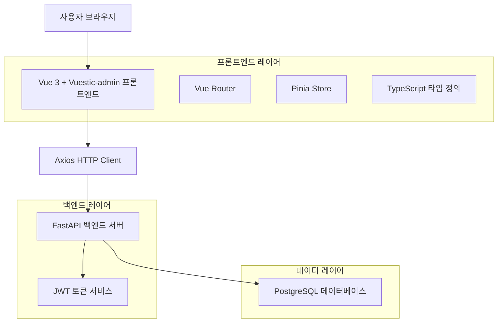
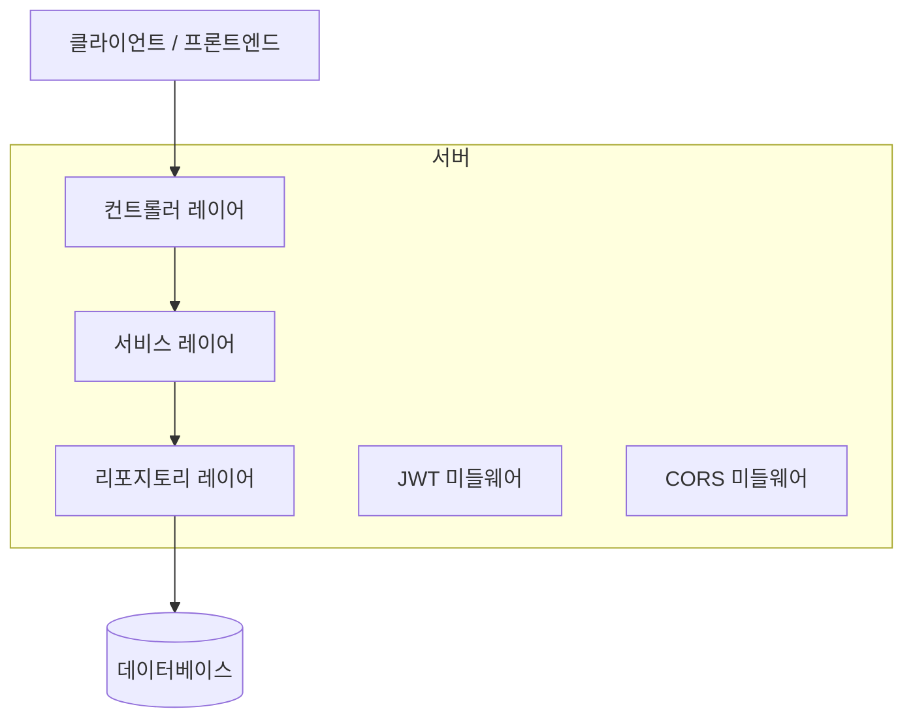
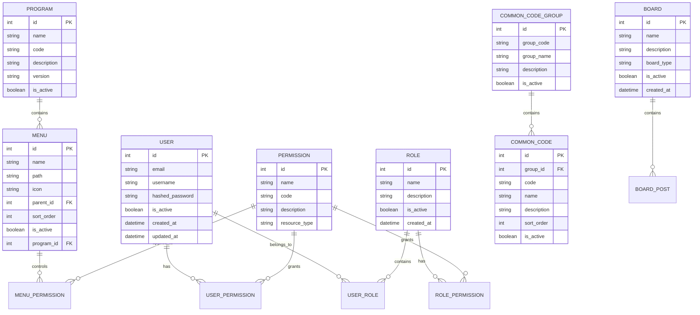

# Vue 3 + Vuestic-admin 관리자 사이트 기술 아키텍처 문서

## 1. 아키텍처 설계



## 2. 기술 스택 설명

* **프론트엔드**: Vue 3 + Vite + TypeScript + Vuestic-admin + Pinia + Vue Router

* **백엔드**: FastAPI (기존 SkyBoot Core API 활용)

* **데이터베이스**: PostgreSQL (기존 백엔드 연동)

* **인증**: JWT (Access/Refresh Token)

* **HTTP 클라이언트**: Axios

* **상태 관리**: Pinia

* **UI 프레임워크**: Vuestic-admin

## 3. 라우트 정의

| 라우트                     | 목적                             |
| ----------------------- | ------------------------------ |
| /admin                  | 관리자 메인 대시보드, 시스템 현황 및 주요 지표 표시 |
| /admin/login            | 로그인 페이지, JWT 기반 인증 처리          |
| /admin/users            | 사용자 관리 페이지, 사용자 목록 및 CRUD 기능   |
| /admin/users/:id        | 사용자 상세 페이지, 개별 사용자 정보 및 권한 관리  |
| /admin/menus            | 메뉴 관리 페이지, 메뉴 구조 및 순서 관리       |
| /admin/programs         | 프로그램 관리 페이지, 시스템 프로그램 등록 및 관리  |
| /admin/menu-permissions | 메뉴 권한 관리 페이지, 역할별 메뉴 접근 권한 설정  |
| /admin/user-permissions | 사용자 권한 관리 페이지, 개별 사용자 권한 설정    |
| /admin/common-codes     | 공통코드 관리 페이지, 시스템 공통코드 관리       |
| /admin/boards           | 게시판 관리 페이지, 게시판 설정 및 관리        |
| /admin/coming-soon      | 미구현 기능 안내 페이지, "곧 출시" 메시지 표시   |

## 4. API 정의

### 4.1 핵심 API

**사용자 인증 관련**

```
POST /api/auth/login
```

요청:

| 파라미터명    | 파라미터 타입 | 필수여부 | 설명       |
| -------- | ------- | ---- | -------- |
| email    | string  | true | 사용자 이메일  |
| password | string  | true | 사용자 비밀번호 |

응답:

| 파라미터명          | 파라미터 타입 | 설명          |
| -------------- | ------- | ----------- |
| access\_token  | string  | JWT 액세스 토큰  |
| refresh\_token | string  | JWT 리프레시 토큰 |
| user           | object  | 사용자 정보 객체   |

예시:

```json
{
  "email": "admin@example.com",
  "password": "password123"
}
```

**토큰 갱신**

```
POST /api/auth/refresh
```

요청:

| 파라미터명          | 파라미터 타입 | 필수여부 | 설명      |
| -------------- | ------- | ---- | ------- |
| refresh\_token | string  | true | 리프레시 토큰 |

**사용자 관리**

```
GET /api/users
POST /api/users
PUT /api/users/{user_id}
DELETE /api/users/{user_id}
```

**메뉴 관리**

```
GET /api/menus
POST /api/menus
PUT /api/menus/{menu_id}
DELETE /api/menus/{menu_id}
```

**권한 관리**

```
GET /api/permissions/menu
POST /api/permissions/menu
GET /api/permissions/user/{user_id}
PUT /api/permissions/user/{user_id}
```

## 5. 서버 아키텍처 다이어그램



## 6. 데이터 모델

### 6.1 데이터 모델 정의



### 6.2 데이터 정의 언어

**사용자 테이블 (users)**

```sql
-- 테이블 생성
CREATE TABLE users (
    id SERIAL PRIMARY KEY,
    email VARCHAR(255) UNIQUE NOT NULL,
    username VARCHAR(100) NOT NULL,
    hashed_password VARCHAR(255) NOT NULL,
    is_active BOOLEAN DEFAULT true,
    created_at TIMESTAMP WITH TIME ZONE DEFAULT NOW(),
    updated_at TIMESTAMP WITH TIME ZONE DEFAULT NOW()
);

-- 인덱스 생성
CREATE INDEX idx_users_email ON users(email);
CREATE INDEX idx_users_username ON users(username);
CREATE INDEX idx_users_is_active ON users(is_active);

-- 초기 데이터
INSERT INTO users (email, username, hashed_password) VALUES
('admin@skyboot.com', 'admin', '$2b$12$hashed_password_here'),
('manager@skyboot.com', 'manager', '$2b$12$hashed_password_here');
```

**역할 테이블 (roles)**

```sql
CREATE TABLE roles (
    id SERIAL PRIMARY KEY,
    name VARCHAR(100) NOT NULL,
    description TEXT,
    is_active BOOLEAN DEFAULT true,
    created_at TIMESTAMP WITH TIME ZONE DEFAULT NOW()
);

-- 초기 데이터
INSERT INTO roles (name, description) VALUES
('시스템관리자', '모든 시스템 기능에 접근 가능한 최고 권한'),
('일반관리자', '제한된 관리 기능에 접근 가능한 권한'),
('운영자', '기본 운영 기능에만 접근 가능한 권한');
```

**메뉴 테이블 (menus)**

```sql
CREATE TABLE menus (
    id SERIAL PRIMARY KEY,
    name VARCHAR(100) NOT NULL,
    path VARCHAR(255),
    icon VARCHAR(100),
    parent_id INTEGER REFERENCES menus(id),
    sort_order INTEGER DEFAULT 0,
    is_active BOOLEAN DEFAULT true,
    program_id INTEGER REFERENCES programs(id),
    created_at TIMESTAMP WITH TIME ZONE DEFAULT NOW()
);

-- 초기 메뉴 데이터
INSERT INTO menus (name, path, icon, sort_order) VALUES
('대시보드', '/admin', 'dashboard', 1),
('사용자 관리', '/admin/users', 'people', 2),
('메뉴 관리', '/admin/menus', 'menu', 3),
('프로그램 관리', '/admin/programs', 'apps', 4),
('권한 관리', '/admin/permissions', 'security', 5),
('공통코드 관리', '/admin/common-codes', 'code', 6),
('게시판 관리', '/admin/boards', 'forum', 7);
```

**권한 테이블 (permissions)**

```sql
CREATE TABLE permissions (
    id SERIAL PRIMARY KEY,
    name VARCHAR(100) NOT NULL,
    code VARCHAR(100) UNIQUE NOT NULL,
    description TEXT,
    resource_type VARCHAR(50),
    created_at TIMESTAMP WITH TIME ZONE DEFAULT NOW()
);

-- 초기 권한 데이터
INSERT INTO permissions (name, code, description, resource_type) VALUES
('사용자 조회', 'USER_READ', '사용자 정보 조회 권한', 'USER'),
('사용자 생성', 'USER_CREATE', '사용자 생성 권한', 'USER'),
('사용자 수정', 'USER_UPDATE', '사용자 정보 수정 권한', 'USER'),
('사용자 삭제', 'USER_DELETE', '사용자 삭제 권한', 'USER'),
('메뉴 관리', 'MENU_MANAGE', '메뉴 관리 권한', 'MENU'),
('권한 관리', 'PERMISSION_MANAGE', '권한 관리 권한', 'PERMISSION');
```

