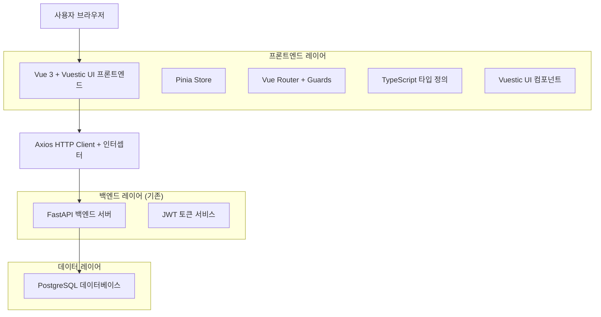
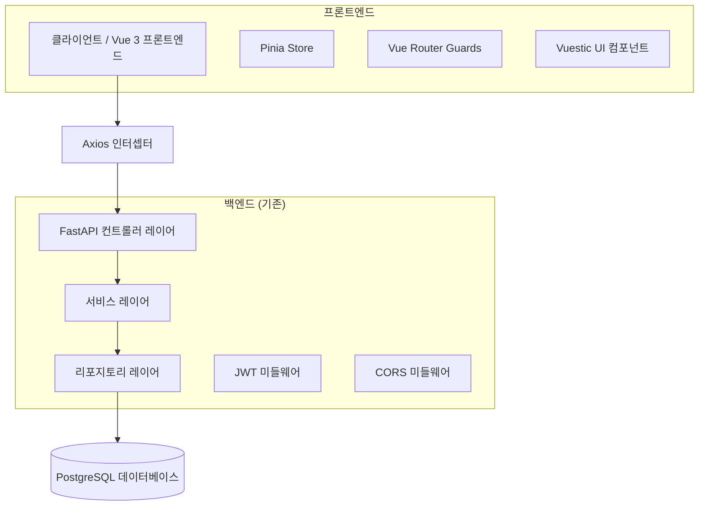
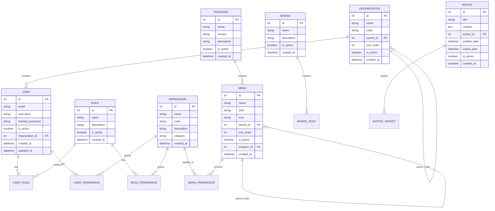

# Vue 3 + Vuestic UI RBAC 관리자 프론트엔드 기술 아키텍처 문서

## 1. 아키텍처 설계



## 2. 기술 스택 설명

- **프론트엔드**: Vue 3 + Vite + TypeScript + Vuestic UI + Pinia + Vue Router + Axios
- **백엔드**: FastAPI (기존 SkyBoot Core API 활용)
- **데이터베이스**: PostgreSQL (기존 백엔드 연동)
- **인증**: JWT (Access/Refresh Token, httpOnly 쿠키)
- **HTTP 클라이언트**: Axios 인스턴스 + 인터셉터
- **상태 관리**: Pinia
- **UI 프레임워크**: Vuestic UI
- **테스트**: Vitest (단위 테스트) + Playwright (E2E 테스트)
- **코드 품질**: ESLint + Prettier

## 3. 라우트 정의

| 라우트 | 목적 |
|--------|------|
| /auth/login | JWT 기반 로그인 페이지, 토큰 발급 및 인증 처리 |
| / | 대시보드 메인 페이지, 시스템 현황 및 주요 지표 표시 |
| /admin/users | 사용자 관리 목록 페이지, 사용자 CRUD 및 권한 관리 |
| /admin/users/:id | 사용자 상세 페이지, 개별 사용자 정보 및 권한 설정 |
| /admin/users/create | 사용자 생성 페이지, 새 사용자 등록 폼 |
| /admin/menus | 메뉴 관리 페이지, 동적 메뉴 구조 및 순서 관리 |
| /admin/programs | 프로그램 관리 페이지, 시스템 프로그램 등록 및 관리 |
| /admin/roles | 권한(역할) 관리 페이지, 역할 정의 및 권한 할당 |
| /admin/organizations | 조직 관리 페이지, 조직 구조 및 사용자 배정 |
| /admin/boards | 게시판 관리 페이지, 게시판 설정 및 관리 |
| /admin/notices | 공지사항 관리 페이지, 공지 작성 및 발송 관리 |
| /errors/403 | 권한 없음 페이지, 접근 권한 부족 시 표시 |
| /errors/404 | 페이지 없음 페이지, 존재하지 않는 라우트 접근 시 표시 |

## 4. API 정의

### 4.1 핵심 API

**사용자 인증 관련**

```
POST /auth/login
```

요청:
| 파라미터명 | 파라미터 타입 | 필수여부 | 설명 |
|-----------|-------------|----------|------|
| email | string | true | 사용자 이메일 |
| password | string | true | 사용자 비밀번호 |

응답:
| 파라미터명 | 파라미터 타입 | 설명 |
|-----------|-------------|------|
| access_token | string | JWT 액세스 토큰 |
| access_expires_in | number | 토큰 만료 시간(초) |
| user | object | 사용자 정보 객체 |

예시:
```json
{
  "email": "admin@example.com",
  "password": "password123"
}
```

**토큰 갱신**

```
POST /auth/refresh
```

응답:
| 파라미터명 | 파라미터 타입 | 설명 |
|-----------|-------------|------|
| access_token | string | 새로운 JWT 액세스 토큰 |
| access_expires_in | number | 토큰 만료 시간(초) |

**사용자 정보 조회**

```
GET /me
```

응답:
| 파라미터명 | 파라미터 타입 | 설명 |
|-----------|-------------|------|
| id | number | 사용자 ID |
| name | string | 사용자 이름 |
| roles | string[] | 사용자 역할 배열 |
| permissions | string[] | 사용자 권한 배열 |

**동적 메뉴 조회**

```
GET /menus
```

응답: MenuItem[]
```typescript
type MenuItem = {
  id: string;
  title: string;
  path?: string;
  icon?: string;
  required?: string[]; // 필요한 권한 배열
  children?: MenuItem[];
}
```

**Admin CRUD API**

각 리소스별 표준 CRUD 엔드포인트:
- GET /admin/{resource} - 목록 조회 (검색, 필터링, 페이지네이션)
- GET /admin/{resource}/{id} - 상세 조회
- POST /admin/{resource} - 생성
- PUT /admin/{resource}/{id} - 수정
- DELETE /admin/{resource}/{id} - 삭제 (소프트 삭제 지원)

리소스 목록:
- users (사용자)
- menus (메뉴)
- programs (프로그램)
- roles (역할)
- organizations (조직)
- boards (게시판)
- notices (공지사항)

## 5. 서버 아키텍처 다이어그램



## 6. 데이터 모델

### 6.1 데이터 모델 정의



### 6.2 데이터 정의 언어 (DDL)

**사용자 테이블 (users)**
```sql
-- 사용자 정보 테이블
CREATE TABLE users (
    id SERIAL PRIMARY KEY,
    email VARCHAR(255) UNIQUE NOT NULL COMMENT '이메일 주소',
    username VARCHAR(100) NOT NULL COMMENT '사용자명',
    hashed_password VARCHAR(255) NOT NULL COMMENT '해시된 비밀번호',
    is_active BOOLEAN DEFAULT TRUE COMMENT '활성 상태',
    organization_id INTEGER REFERENCES organizations(id) COMMENT '소속 조직 ID',
    created_at TIMESTAMP WITH TIME ZONE DEFAULT NOW() COMMENT '생성일시',
    updated_at TIMESTAMP WITH TIME ZONE DEFAULT NOW() COMMENT '수정일시'
);

-- 인덱스 생성
CREATE INDEX idx_users_email ON users(email);
CREATE INDEX idx_users_organization ON users(organization_id);
CREATE INDEX idx_users_active ON users(is_active);
```

**역할 테이블 (roles)**
```sql
-- 역할 정보 테이블
CREATE TABLE roles (
    id SERIAL PRIMARY KEY,
    name VARCHAR(100) NOT NULL COMMENT '역할명',
    description TEXT COMMENT '역할 설명',
    is_active BOOLEAN DEFAULT TRUE COMMENT '활성 상태',
    created_at TIMESTAMP WITH TIME ZONE DEFAULT NOW() COMMENT '생성일시'
);

-- 초기 데이터
INSERT INTO roles (name, description) VALUES
('시스템 관리자', '모든 시스템 기능에 접근 가능한 최고 권한'),
('일반 관리자', '할당된 메뉴에 대한 관리 권한'),
('운영자', '기본 운영 기능 및 조회 권한'),
('뷰어', '읽기 전용 접근 권한');
```

**권한 테이블 (permissions)**
```sql
-- 권한 정보 테이블
CREATE TABLE permissions (
    id SERIAL PRIMARY KEY,
    name VARCHAR(100) NOT NULL COMMENT '권한명',
    code VARCHAR(50) UNIQUE NOT NULL COMMENT '권한 코드',
    description TEXT COMMENT '권한 설명',
    category VARCHAR(50) COMMENT '권한 카테고리',
    created_at TIMESTAMP WITH TIME ZONE DEFAULT NOW() COMMENT '생성일시'
);

-- 초기 권한 데이터
INSERT INTO permissions (name, code, description, category) VALUES
('사용자 조회', 'user:read', '사용자 목록 및 상세 정보 조회', 'user'),
('사용자 생성', 'user:create', '새 사용자 생성', 'user'),
('사용자 수정', 'user:update', '사용자 정보 수정', 'user'),
('사용자 삭제', 'user:delete', '사용자 삭제', 'user'),
('메뉴 관리', 'menu:manage', '메뉴 구조 관리', 'menu'),
('권한 관리', 'permission:manage', '권한 및 역할 관리', 'permission');
```

**메뉴 테이블 (menus)**
```sql
-- 메뉴 정보 테이블
CREATE TABLE menus (
    id SERIAL PRIMARY KEY,
    name VARCHAR(100) NOT NULL COMMENT '메뉴명',
    path VARCHAR(255) COMMENT '라우트 경로',
    icon VARCHAR(50) COMMENT '아이콘 이름',
    parent_id INTEGER REFERENCES menus(id) COMMENT '상위 메뉴 ID',
    sort_order INTEGER DEFAULT 0 COMMENT '정렬 순서',
    is_active BOOLEAN DEFAULT TRUE COMMENT '활성 상태',
    program_id INTEGER REFERENCES programs(id) COMMENT '프로그램 ID',
    created_at TIMESTAMP WITH TIME ZONE DEFAULT NOW() COMMENT '생성일시'
);

-- 초기 메뉴 데이터
INSERT INTO menus (name, path, icon, sort_order) VALUES
('대시보드', '/', 'dashboard', 1),
('사용자 관리', '/admin/users', 'people', 2),
('메뉴 관리', '/admin/menus', 'menu', 3),
('권한 관리', '/admin/roles', 'security', 4),
('조직 관리', '/admin/organizations', 'business', 5),
('게시판 관리', '/admin/boards', 'forum', 6),
('공지사항 관리', '/admin/notices', 'announcement', 7);
```

## 7. 프론트엔드 구현 세부사항

### 7.1 프로젝트 구조

```
src/
├── api/
│   ├── axios.ts              # Axios 인스턴스 및 인터셉터
│   ├── auth.ts               # 인증 관련 API
│   └── admin/
│       ├── users.ts          # 사용자 관리 API
│       ├── menus.ts          # 메뉴 관리 API
│       ├── roles.ts          # 권한 관리 API
│       └── ...
├── stores/
│   ├── auth.ts               # 인증 상태 관리
│   ├── menu.ts               # 메뉴 상태 관리
│   └── theme.ts              # 테마 상태 관리
├── router/
│   ├── index.ts              # 라우터 설정 및 가드
│   ├── routes-static.ts      # 정적 라우트 정의
│   └── dynamic.ts            # 동적 라우트 생성 유틸
├── layouts/
│   └── AppLayout.vue         # 메인 레이아웃 (헤더 + 사이드바)
├── components/
│   ├── nav/
│   │   └── Sidebar.vue       # 동적 사이드바
│   └── common/
│       └── AccessGuard.vue   # 권한 가드 컴포넌트
├── pages/
│   ├── auth/
│   │   └── Login.vue         # 로그인 페이지
│   ├── Dashboard.vue         # 대시보드
│   └── errors/
│       ├── 403.vue           # 권한 없음
│       └── 404.vue           # 페이지 없음
├── modules/
│   └── admin/
│       ├── users/
│       │   ├── List.vue      # 사용자 목록
│       │   ├── Create.vue    # 사용자 생성
│       │   ├── Edit.vue      # 사용자 수정
│       │   └── types.ts      # 타입 정의
│       └── ...
├── styles/
│   └── main.css              # 전역 스타일
├── types/
│   ├── auth.ts               # 인증 관련 타입
│   ├── menu.ts               # 메뉴 관련 타입
│   └── api.ts                # API 응답 타입
├── utils/
│   ├── permissions.ts        # 권한 체크 유틸
│   └── constants.ts          # 상수 정의
├── main.ts                   # 앱 진입점
└── App.vue                   # 루트 컴포넌트
```

### 7.2 핵심 구현 요소

**Axios 인터셉터 (api/axios.ts)**
- 요청 시 Authorization 헤더 자동 추가
- 401 응답 시 자동 토큰 갱신 시도
- 갱신 실패 시 로그아웃 및 로그인 페이지 리다이렉트
- 동시 요청 큐잉 처리

**인증 스토어 (stores/auth.ts)**
- 상태: accessToken, accessExp, user, isLoading
- 액션: login, logout, refresh, fetchMe
- 게터: isAuthenticated, hasPermission
- 토큰 메모리 + sessionStorage 이중화

**라우터 가드 (router/index.ts)**
- beforeEach: 인증 체크, 권한 체크
- 토큰 만료 근접 시 백그라운드 갱신
- 권한 부족 시 403 페이지 또는 접근 가능한 첫 메뉴로 리다이렉트

**메뉴 스토어 (stores/menu.ts)**
- 서버에서 메뉴 트리 로드
- 사용자 권한 기반 메뉴 필터링
- 동적 라우트 생성 및 등록
- 현재 활성 메뉴 상태 관리

### 7.3 테스트 구조

```
tests/
├── unit/
│   ├── stores/
│   │   ├── auth.spec.ts      # 인증 스토어 테스트
│   │   └── menu.spec.ts      # 메뉴 스토어 테스트
│   ├── utils/
│   │   └── permissions.spec.ts # 권한 유틸 테스트
│   └── components/
│       └── Sidebar.spec.ts   # 사이드바 컴포넌트 테스트
└── e2e/
    ├── auth.spec.ts          # 로그인 플로우 테스트
    ├── navigation.spec.ts    # 네비게이션 테스트
    └── admin.spec.ts         # 관리 기능 스모크 테스트
```

## 8. 배포 및 환경 설정

### 8.1 환경 변수

```env
# .env.example
VITE_API_BASE_URL=http://localhost:8000
VITE_APP_TITLE=SkyBoot Admin
VITE_ENABLE_MOCK=false
```

### 8.2 빌드 설정

**vite.config.ts**
- TypeScript 엄격 모드
- Vuestic UI 플러그인
- 프록시 설정 (개발 환경)
- 빌드 최적화

**tsconfig.json**
- 엄격한 타입 체크
- 경로 별칭 설정
- Vue 3 타입 지원

### 8.3 코드 품질 도구

**ESLint + Prettier**
- Vue 3 + TypeScript 규칙
- 자동 포맷팅
- 커밋 전 린트 체크

**Vitest**
- 단위 테스트 프레임워크
- Vue 컴포넌트 테스트 지원
- 커버리지 리포트

**Playwright**
- E2E 테스트 프레임워크
- 크로스 브라우저 테스트
- 스크린샷 비교